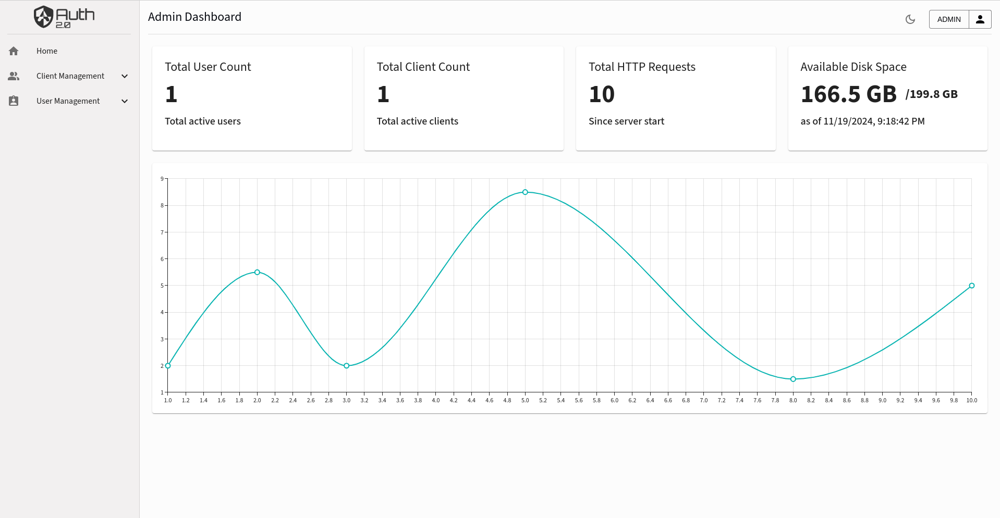
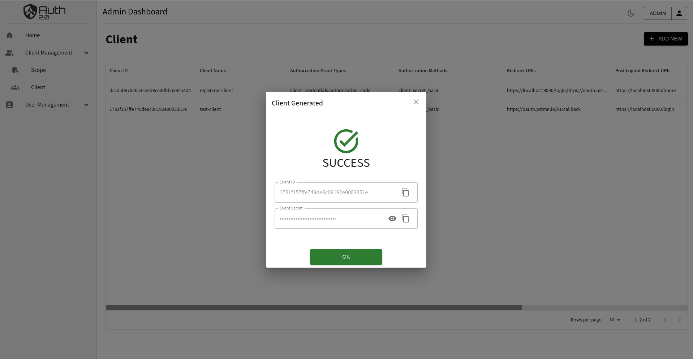

# OAuth 2.0 Authorization Dashboard 

[](https://react.dev/)
[](https://mui.com/)
[](https://nodejs.org/)
[](https://yarnpkg.com/)
[](LICENSE.md)

This dashboard provides a clean, user-friendly interface to manage **user authentication, client registration, and account settings**.

> 🚀 A modern **React-based** dashboard for the [OAuth2 Authorization Service Backend](https://github.com/shubham225/authorization-service), built using **React** and **Material UI**.


## ✨ Features
- **User Authentication** — Login, register, and manage accounts securely.
- **Client Management** — Register OAuth2.0 clients and view credentials.
- **Responsive UI** — Fully optimized for desktop and mobile.
- **Dark Mode** — Seamless theme switching.
- **Real-Time Form Validation** — Improve user experience and prevent errors.


## 📦 Installation

### Prerequisites
- **Node.js** `>= 14.0.0`
- **Yarn** `>= 1.22.22`


### Steps

1. **Clone the repository**
   ```bash
   git clone https://github.com/shubham225/auth2.0-service-dashboard.git
   cd auth2.0-service-dashboard
   ```

2. **Install dependencies**
   ```bash
   yarn install
   ```

3. **Run the application (development mode)**
   ```bash
   yarn start
   ```

4. **Build the application for production**
   ```bash
   yarn build
   ```

5. **Deploy inside the Authorization Server backend**
   ```bash
   cp -r <path-to-frontend>/build <path-to-backend>/src/main/resources/static
   ```


## 🖼 Screenshots

**Login Page**  


**Home Page**  


**Client Registration**  


**Generated Client**  


**Form Validations**  


**Dark Mode**  


## 📜 License
This project is licensed under the **MIT License** — see the [LICENSE.md](LICENSE.md) file for details.

