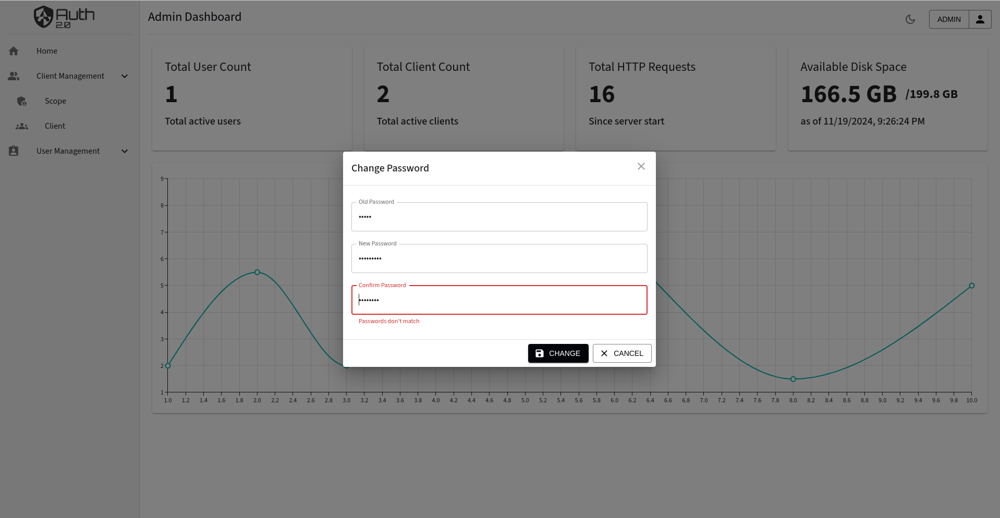

# Authorization Service Dashboard - Frontend

This is the frontend project for the [authorization-service](https://github.com/shubham225/authorization-service) backend, which provides an authentication service. This dashboard allows users to interact with the authentication service API, providing a user-friendly interface for login, registration, and account management.

## Installation

### Prerequisites
- Node.js (>= 14.0.0)
- yarn (>= 1.22.22)

### Steps
1. **Clone the repository**
    ```bash
    git clone https://github.com/shubham225/auth2.0-service-dashboard.git
    cd auth2.0-service-dashboard
    ```

2. **Install dependencies**
    ```bash
    yarn install
    ```

3. **Run the application**
    ```bash
    yarn start
    ```

4. **Build the application for production**
    ```bash
    yarn build
    ```

5. **Copy the build in Authentication server backend as resources**
    ```bash
    cp <path-to-front-end>/build <path-to-backend>/src/main/resources/static
    ```

## Screenshots
*Login Page*


*Home Page*


*Client Registration*


*Generated Client*


*Form Validations*


*Dark Mode*


## License
This project is licensed under the MIT License - see the [LICENSE](LICENSE.md) file for details.